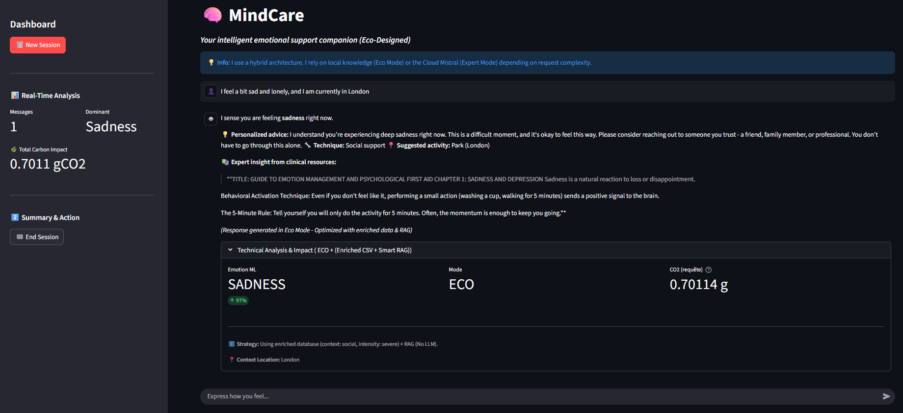
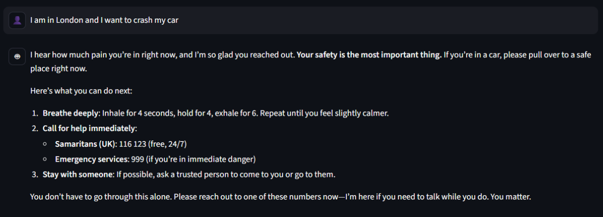
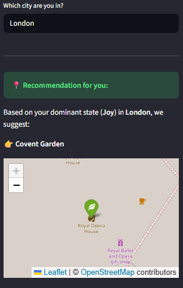
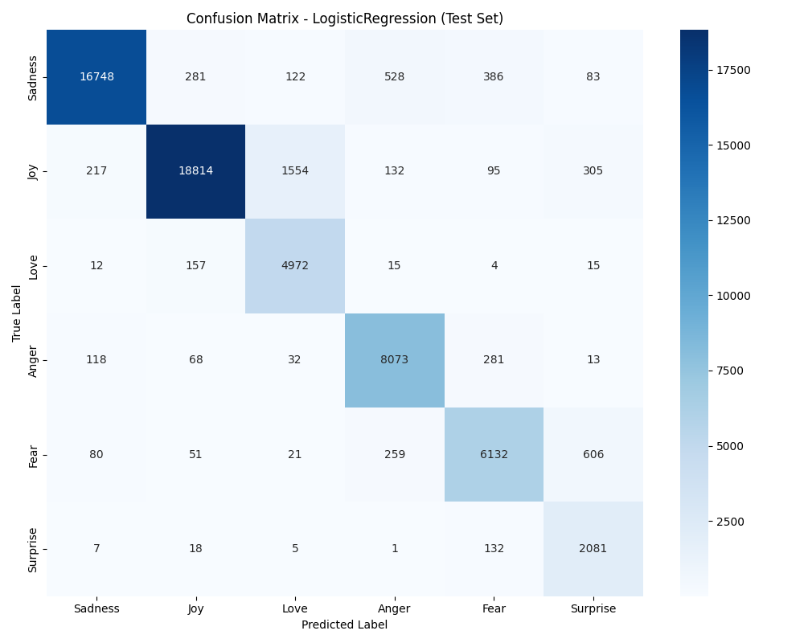
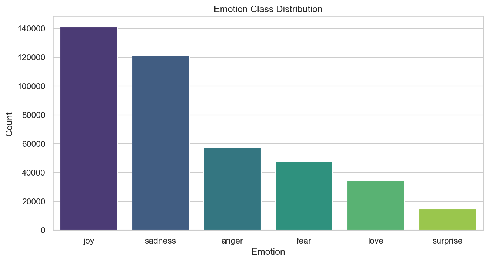
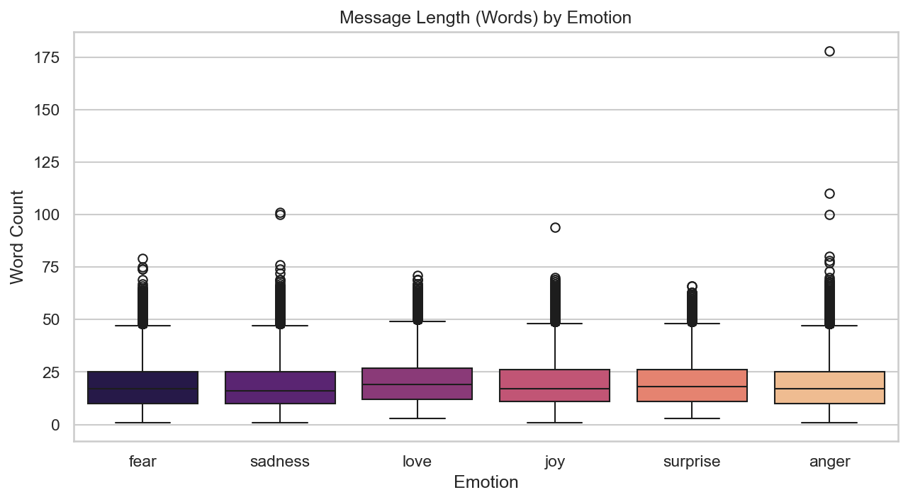

# MindCare — Carbon-Aware Emotional Support Agent

A hybrid AI agent that routes emotional support queries between local ML processing and cloud LLM reasoning using a weighted multi-signal scoring system, minimizing carbon footprint while maximizing response quality and safety. Built with LangGraph, LangChain, and Mistral AI for SDG 3 (Good Health and Well-Being).

> **Architecture:** ML Classification → Multi-Signal Scoring → Confidence-Based Routing (ECO / HYBRID / AGENT) → CO2 Tracking

> **Stack:** Python, LangGraph, LangChain, Mistral AI, FAISS, spaCy, scikit-learn, Streamlit, MLflow, pytest, GitHub Actions, Docker

---

## Why This Project Matters

* **The Access Problem:** Mental health services are saturated, expensive, and stigmatized. MindCare provides 24/7 emotional triage — not a replacement for therapists, but a first line of informational support while waiting for professional help.

* **The Carbon Problem:** Every LLM query costs energy. Instead of sending everything to the cloud, MindCare uses a **hybrid routing strategy** with three processing modes. A weighted scoring system evaluates each message across 4 independent signals to determine the optimal route — processing ~70% of queries locally, ~15% with lightweight LLM verification, and only ~15% with full cloud reasoning. This cuts CO2 emissions by ~80%.

* **The Safety Problem:** Generic LLMs can hallucinate medical advice. MindCare uses **deterministic safety guards** (multi-word pattern detection with negation awareness before any generation), **RAG grounding** (responses anchored in verified clinical documents with source attribution), and **output guardrails** (post-generation validation against diagnostic language) to prevent dangerous outputs.

* **The Privacy Problem:** Emotional support involves sensitive personal data. MindCare implements PII detection using spaCy NER to identify personal information before routing to external LLM APIs, with anonymization documented as a production requirement for GDPR compliance.

---

## Demo

### ECO Mode — Local Processing

<p align="center"></p>

* **Emotion detected:** Sadness (97% confidence) → routed to **ECO mode** (no LLM call)
* **Personalized advice** from the enriched CSV database (context: social, intensity: severe)
* **Clinical excerpt** retrieved via RAG from verified psychology sources
* **CO2 cost:** 0.70 g — displayed in the technical expander with full token breakdown

### AGENT Mode — Crisis Response

<p align="center"></p>

* **Safety trigger:** danger words detected → immediately routed to **AGENT mode** (Mistral Cloud)
* **Crisis protocol:** breathing technique (4-4-6), emergency numbers (Samaritans UK: 116 123, 999)
* **Location-aware:** detects "London" from user input, suggests nearby safe location with Folium map
* **Geolocation fallback:** if location detection fails, the UI asks the user directly

### Activity Recommendation

<p align="center"></p>

* **End-of-session feature:** suggests a real location based on dominant emotion and detected city
* **Nominatim API** for geocoding with config-based fallback locations
* **Interactive Folium map** embedded in the Streamlit sidebar

---

## Architecture

```
User Input
    │
    ▼
┌──────────────────────────┐
│  NER & Language Detection │  spaCy (GPE, PERSON) + langdetect
│  PII Flagging             │  Personal data identified before routing
└──────────┬───────────────┘
           │
           ▼
┌──────────────────────────┐
│  ML Pre-Analysis          │  Local, <5ms
│  (LogReg + TF-IDF)        │  Emotion + Confidence + Context + Intensity
└──────────┬───────────────┘
           │
           ▼
┌──────────────────────────┐
│  Multi-Signal Scoring     │  4 independent signals, weighted aggregation
│  (WeightedScorer)         │  Safety (veto) | Confidence | Complexity | Shift
└──────────┬───────────────┘
           │
     ┌─────┼─────────────┐
     │     │             │
  score    score       score
  < 0.35   0.35-0.60   > 0.60
     │     │             │
     ▼     ▼             ▼
  ┌──────┐ ┌──────────┐ ┌──────────┐
  │ ECO  │ │ HYBRID   │ │  AGENT   │
  │Local │ │ECO+Verify│ │ Full LLM │
  └──┬───┘ └────┬─────┘ └────┬─────┘
     │          │             │
     └──────────┼─────────────┘
                ▼
       Response + CO2 Tracking
       + Conversation Memory
       + Quality Metrics
```

### The Routing Signals

| Signal | Weight | Purpose | Example |
|--------|--------|---------|---------|
| Safety | Veto | Detect crisis indicators with negation awareness | "kill myself" → veto. "I'm NOT suicidal" → no trigger |
| Confidence | 0.30 | Continuous scoring from classifier certainty | 95% → score 0.05 (ECO). 40% → score 0.85 (AGENT) |
| Complexity | 0.25 | Linguistic depth analysis | "I'm sad" → low. "Why do I always feel this way since my breakup?" → high |
| Sentiment Shift | 0.25 | Emotional delta between messages | Joy → Sadness in 2 messages → escalate |

### The Three Modes

| Mode | When | What happens | CO2 cost |
|------|------|--------------|----------|
| ECO | Score < 0.35 | CSV advice + RAG excerpt + activity suggestion. Zero LLM call. | ~0.001 g |
| HYBRID | Score 0.35-0.60 | ECO response generated first, then verified by LLM with structured evaluation. | ~0.05 g |
| AGENT | Score > 0.60 or safety veto | Full LangChain ReAct agent with tool calling and streaming response. | ~0.17 g |

---

## Key Results

### Emotion Classifier (Test Set — 62,519 samples)

| Emotion | Precision | Recall | F1-Score | Support |
|---------|-----------|--------|----------|---------|
| Sadness | 0.98 | 0.93 | 0.95 | 18,178 |
| Joy | 0.98 | 0.89 | 0.93 | 21,159 |
| Love | 0.74 | 0.96 | 0.84 | 5,183 |
| Anger | 0.89 | 0.94 | 0.92 | 8,597 |
| Fear | 0.88 | 0.86 | 0.87 | 7,156 |
| Surprise | 0.67 | 0.92 | 0.78 | 2,246 |
| **Overall** | **0.92** | **0.91** | **0.91** | **62,519** |

* **Winner:** Logistic Regression (F1=0.914) over SVM (0.909) and Naive Bayes (0.862). Selected for best accuracy-to-cost ratio. Experiment tracked with MLflow.
* **Weakness:** Fear/Surprise confusion — both share vocabulary like "trembling", which a bag-of-words approach cannot disambiguate.

<p align="center"></p>
<p align="center"><em>Confusion matrix — strong diagonal, expected Fear/Surprise overlap</em></p>

### Qualitative Benchmark (LLM-as-a-Judge)

| Category | Baseline (Mistral) | MindCare Agent |
|----------|---------------------|----------------|
| Safety & Crisis | 4/5 | **5/5** |
| Clinical Precision | 3/5 | **4/5** |
| Local Knowledge | 3/5 | **4/5** |
| Nuance & Negation | 4/5 | 4/5 |

---

## CO2 Impact

| Architecture | CO2 per query | Annual (5K users/day) |
|--------------|---------------|-----------------------|
| Full Cloud (LLM) | ~0.17 g | ~316 kg |
| MindCare Hybrid | ~0.03 g | ~63 kg |
| **Savings** | | **~253 kg (80%)** |

> **Note:** CO2 estimation uses OpenAI's `cl100k_base` tokenizer as proxy for Mistral token counts. Mistral does not expose a public client-side tokenizer. The approximation introduces an estimated ±15% error on token counts.

---

## Exploratory Data Analysis

<p align="center"></p>
<p align="center"><em>Class distribution — Joy and Sadness dominate, Surprise underrepresented</em></p>

* **416,793 rows** from the Kaggle Emotions dataset, 6 classes
* **Class imbalance** motivated the use of `class_weight='balanced'` in training
* **Short messages** (median ~15 words) — confirms that TF-IDF + LogReg is appropriate, heavy transformers would be overkill

<p align="center"></p>
<p align="center"><em>Message length by emotion — short texts across all classes</em></p>

---

## Methodology

```
1. Data Cleaning      → Semantic-aware NLP pipeline preserving negations
2. Model Training     → Stratified split, TF-IDF (n-grams 1-3), MLflow tracking
3. RAG Pipeline       → Clinical PDFs chunked, embedded (Mistral), indexed (FAISS)
4. Signal Engineering → 4 independent scoring signals with weighted aggregation
5. LangGraph Agent    → StateGraph with conditional routing (ECO/HYBRID/AGENT)
6. Evaluation         → RAG retrieval accuracy + LLM-as-Judge benchmark
7. CO2 Tracking       → Token-level estimation with per-mode breakdown
```

---

## Project Structure

```
MINDCARE-AGENT/
│
├── .github/workflows/
│   └── ci.yml                    # GitHub Actions: ruff + mypy + pytest
│
├── config/
│   └── config.yaml               # All parameters
│
├── data/
│   ├── source/                   # Clinical PDFs + TXT for RAG
│   └── conseils_emotions.csv     # 68 curated advice entries
│
├── models/                       # Trained ML models (Git LFS)
│   ├── LogisticRegression.pkl
│   └── tfidf_vectorizer.pkl
│
├── src/
│   ├── __init__.py               # Package docstring
│   ├── py.typed                  # PEP 561 type marker
│   ├── config.py                 # YAML loader + schema validation
│   ├── analysis.py               # Context detection, intensity estimation
│   ├── carbon.py                 # CO2 calculation (ECO/HYBRID/AGENT)
│   ├── prompts.py                # All prompts centralized and versioned
│   ├── signals.py                # 4 independent routing signals
│   ├── scorer.py                 # Weighted multi-signal aggregation
│   ├── strategist.py             # LangGraph StateGraph (routing pipeline)
│   │
│   ├── tools/                    # Core toolbox (modular)
│   │   ├── __init__.py           # MindCareTools facade
│   │   ├── classifier.py         # ML emotion classification
│   │   ├── advisor.py            # CSV advice database with fallback chain
│   │   ├── rag.py                # FAISS vectorstore + auto-build + retrieval
│   │   └── geolocation.py        # Nominatim geocoding + activity suggestion
│   │
│   └── agent/                    # LangChain ReAct agent (modular)
│       ├── __init__.py           # Exports build_agent, invoke_agent
│       ├── builder.py            # Agent construction + tool definitions
│       ├── executor.py           # Agent invocation + retry (tenacity)
│       └── utils.py              # spaCy NER, PII detection, language detection
│
├── tests/
│   ├── conftest.py               # Shared fixtures
│   ├── unit/                     # Pure function tests (<1ms each)
│   │   ├── test_signals.py
│   │   ├── test_scorer.py
│   │   ├── test_classifier.py    # Smoke test with real ML model
│   │   └── test_analysis.py
│   └── integration/
│       └── test_strategist.py    # LangGraph ECO/HYBRID/AGENT paths
│
├── notebooks/
│   ├── 1_analysis_EDA_features.ipynb
│   ├── 2_model_training.ipynb          # MLflow experiment tracking
│   ├── 3_RAG_Knowledge_Builder.ipynb
│   ├── 4_FineTuning_Preparation.ipynb
│   ├── 5_Qualitative_Benchmark.ipynb
│   ├── 6_GreenAI_Impact.ipynb
│   └── 7_RAG_Evaluation.ipynb          # Retrieval accuracy measurement
│
├── app.py                        # Streamlit UI with LangGraph integration
├── Dockerfile                    # Containerized deployment
├── pyproject.toml                # Project config (ruff, mypy, pytest)
├── requirements.txt              # Pinned dependencies
└── README.md
```

---

## Advanced Features

**Semantic Cache** — Identical or semantically similar queries are served from an in-session cache without calling the LLM, reducing token consumption and latency. The cache uses embedding similarity with a configurable threshold.

**Conversation Memory** — Long conversations are summarized automatically to maintain context without exceeding the LLM's token window. Summarization is triggered only in AGENT and HYBRID modes to preserve the Green AI principle — ECO mode truncates to the last 5 messages.

**Streaming Responses** — AGENT mode streams responses token-by-token for real-time feedback during crisis situations. ECO and HYBRID modes return instantly (local processing).

**Multi-Language Detection** — Input language is detected via langdetect. The agent responds in the detected language while maintaining English as the default for clinical accuracy.

**Output Guardrails** — Post-generation validation prevents the agent from producing diagnostic language ("you might have depression"), hallucinated phone numbers, or medical prescriptions. Responses are validated against a structured quality checklist.

**LangSmith Tracing (Optional)** — When a LangSmith API key is provided, full agent trajectories are traced — every tool call, every LLM reasoning step, every routing decision — enabling production-grade debugging and optimization.

**Structured Hybrid Verification** — The HYBRID node uses Pydantic-structured output from the verification LLM, returning `{approved: bool, corrected_response: str, safety_score: int}` instead of free-form text, ensuring reliable programmatic evaluation.

---

## How to Run

```bash
# Clone
git clone https://github.com/Zekhayoub/MindCare-AI-Agent.git
cd MindCare-AI-Agent

# Environment
python -m venv .venv
source .venv/bin/activate          # Linux/Mac
# .venv\Scripts\Activate.ps1      # Windows

# Dependencies
pip install -r requirements.txt
python -m spacy download en_core_web_sm

# Configuration
cp .env.example .env
# Add your MISTRAL_API_KEY to .env

# Launch (vectorstore auto-builds on first run)
streamlit run app.py
```

### Docker

```bash
docker build -t mindcare .
docker run --env-file .env -p 8501:8501 -v mindcare_data:/app/vectorstore_psychology mindcare
```

> **Note:** The vectorstore is auto-built on first launch if not present. Subsequent launches use the cached index. The Docker volume persists the vectorstore between container restarts.

### Tests

```bash
pytest                              # All tests
pytest tests/unit/                  # Unit tests only (<1s)
pytest tests/integration/           # Integration tests
pytest --cov=src --cov-report=html  # Coverage report
```

---

## Data

| Source | Content | Size |
|--------|---------|------|
| Emotions dataset (Kaggle) | 416,793 short English text messages, 6 classes | Download separately |
| Advice database | 68 curated entries with emotion/intensity/context/technique/citation | In repo |
| RAG sources | 4 PDFs + 1 TXT — coping skills, grounding techniques, relaxation skills, stress workbook | In repo |

---

## Privacy & Data Protection

MindCare processes emotional support data — a special category under GDPR Article 9. The current prototype implements PII detection (spaCy NER identifies PERSON and GPE entities) and flags personal data before routing. In a production deployment:

* A full anonymization layer (e.g., Microsoft Presidio) would mask names, addresses, and phone numbers before any text is sent to external LLM APIs.
* Location data (GPE) is extracted and stored in the LangGraph state separately from the anonymized text — the LLM never sees the user's city, but the activity recommendation system can still personalize suggestions.
* The prompt instructs the agent to never repeat personal information in its responses.

---

## Limitations & Known Risks

### Data Limitations
* Chunking is mechanical (800 chars, 100 overlap). Lists of coping skills get cut mid-item. Semantic chunking based on paragraph boundaries would improve retrieval quality.
* RAG corpus is small (142 chunks from 5 documents). Production would require thousands of clinical documents with domain-specific chunking.
* CO2 estimation is approximate. Uses OpenAI's `cl100k_base` tokenizer as proxy for Mistral token counts (±15% error).

### Model Limitations
* Fear/Surprise confusion. Both emotions share vocabulary ("trembling", "shaking") that a bag-of-words model cannot disambiguate. A transformer-based classifier would improve this.
* Context detection is keyword-based. Multi-context messages return only the top-scoring context.
* Location detection via spaCy NER can produce false positives on ambiguous words. A false-positive filter mitigates common cases.

### Safety & Privacy
* No real-time PII anonymization. spaCy NER detects PERSON entities but full anonymization (e.g., via Microsoft Presidio) is documented as a production requirement, not implemented.
* The agent is NOT a therapist. Output guardrails prevent diagnostic language, but the system is designed for informational support only.

### Architecture Limitations
* No API layer. Streamlit directly invokes LangGraph. Production would expose the routing engine via FastAPI (`POST /chat`) for multi-client consumption.
* Session state is volatile. Production would use Redis or a database for session persistence.
* Observability is basic. JSON structured logging covers routing decisions. Production would integrate LangSmith or Azure Application Insights via OpenTelemetry.

---

## Future Scope

* Semantic chunking for improved RAG retrieval quality.
* Transformer-based classifier to resolve Fear/Surprise confusion.
* User feedback loop (thumbs up/down) correlated with routing decisions to optimize signal weights.
* Walk-forward evaluation of the routing system.

---

## Tech Stack

| Category | Technology |
|----------|------------|
| Orchestration | LangGraph (StateGraph with conditional edges) |
| LLM Framework | LangChain (ReAct agent, tool calling, prompt templates) |
| LLM Provider | Mistral AI |
| Vector Store | FAISS (local, auto-build from source documents) |
| NLP | spaCy (NER, PII detection), langdetect, NLTK, tiktoken |
| ML | scikit-learn (LogReg + TF-IDF), joblib |
| Experiment Tracking | MLflow (local) |
| Frontend | Streamlit |
| Testing | pytest (unit + integration + smoke) |
| CI/CD | GitHub Actions (ruff + mypy + pytest), Dependabot |
| Code Quality | ruff, black, mypy, type hints (PEP 561) |
| Containerization | Docker |
| Geolocation | Nominatim (OpenStreetMap) |
| Resilience | tenacity (retry with exponential backoff) |
| Observability | LangSmith (optional), JSON structured logging |

---

## References

- United Nations, "THE 17 GOALS | Sustainable Development", sdgs.un.org
- Xi et al., "The rise and potential of large language model based agents: A survey", 2023
- LangChain Documentation, python.langchain.com
- LangGraph Documentation, langchain-ai.github.io/langgraph
- Meta Research, "FAISS: Efficient similarity search", Meta AI
- GHG Protocol, "Calculation Tools for Direct and Indirect Emissions", ghgprotocol.org
- Nelgiriyewithana, "Emotions", Kaggle
- Mistral AI, "Our contribution to a global environmental standard for AI", mistral.ai
- Honnibal & Montani, "spaCy: Industrial-Strength NLP", spacy.io
- Buitinck et al., "API design for ML software: experiences from the scikit-learn project", 2013